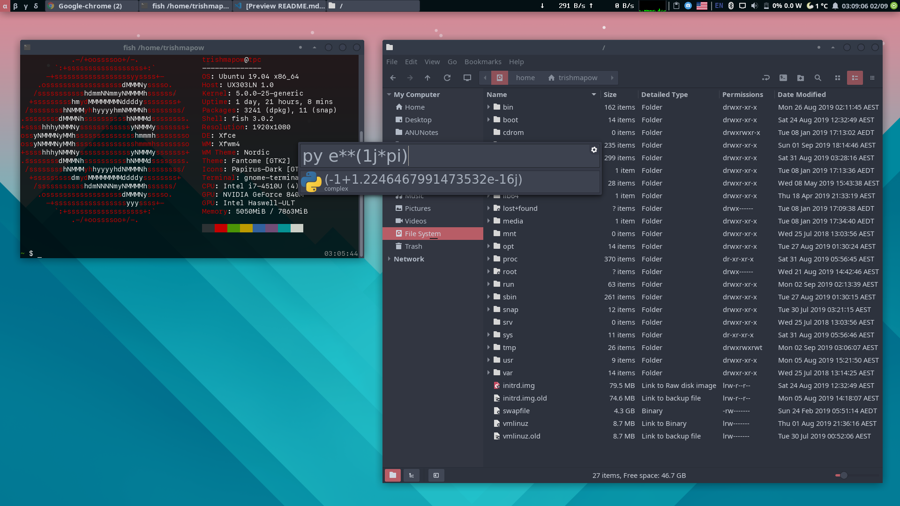

# linux-setup
Files/notes on my current/past Linux setups

*xfce4-panel + gnome-terminal + Nemo + Albert launcher, themes as shown*

### Latest setup: [2019 - Ubuntu 19.04](ubuntu2019.md) → [2019Q4 - Pop\! OS](popos2019.md)

[Wine - what does(n't) work](wine.md)

[Windows 10 KVM config](win10.xml)

[Nano config](.nanorc)

**Log**
- 18.04 -> 19.04 idle power up to ~7.7W from ~5-6W, unknown cause
  - not DE (GNOME)
  - tried previous kernel 4.18.x
  - powertop tunables no effect

**Previous**

- 2019 -- Ubuntu 18.04 LTS
- 2018 -- Antergos (Arch Linux install script)
- 20xx-2017 -- Debian (dual-boot, rarely used)
